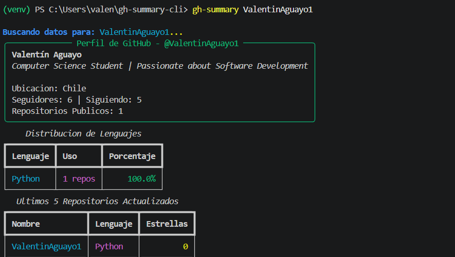

# 🚀 gh-summary-cli

<p align="center">
  <a href="https://github.com/ValentinAguayo1/gh-summary-cli/actions">
    
  </a>
  <a href="https://www.python.org/">
    
  </a>
  <a href="https://opensource.org/licenses/MIT">
    
  </a>
  <a href="https://ai.google.dev/">
    
  </a>
  <a href="https://github.com/astral-sh/ruff">
    
  </a>
</p>

<p align="center">
  <strong>A fast, modular, and interactive Command Line Interface (CLI) built with Python to analyze GitHub profiles, audit repository health, compare developers side-by-side, and generate executive summaries powered by Gemini AI.</strong>
</p>

<p align="center">
  <a href="#-features"><strong>Features</strong></a> •
  <a href="#-preview"><strong>Preview</strong></a> •
  <a href="#-architecture"><strong>Architecture</strong></a> •
  <a href="#-quick-start"><strong>Installation</strong></a> •
  <a href="#-usage"><strong>Usage</strong></a> •
  <a href="#-testing"><strong>Testing</strong></a> •
  <a href="https://github.com/ValentinAguayo1/gh-summary-cli/issues"><strong>Report Issue</strong></a>
</p>

---

# ✨ Features

- 👤 **Interactive Profile Dashboard (`fetch`)**
  - View GitHub profile information, repositories, language statistics, and activity directly in the terminal.

- 🤖 **Executive AI Summaries (`-a` / `--ai-summary`)**
  - Generate concise executive summaries of GitHub profiles using **Google Gemini 3.5 Flash**.

- 🩺 **Repository Health Auditor (`health`)**
  - Analyze open-source best practices including:
    - License
    - Repository description
    - Recent activity
    - Overall repository health score (0–100)

- ⚔️ **Developer Comparison (`compare`)**
  - Compare two GitHub profiles side-by-side using asynchronous requests.

- 📤 **Export Reports**
  - Markdown (`.md`)
  - JSON (`.json`)

- ⚡ **High Performance**
  - Built with **httpx** and **asyncio** for fast concurrent API requests.

---

# 📸 Preview

<p align="center">
  
</p>

---

# 📐 Architecture

```text
┌─────────────────┐       Async HTTP GET       ┌──────────────────────┐
│  gh-summary CLI │ ─────────────────────────► │    GitHub REST API   │
│  (Typer / Rich) │ ◄───────────────────────── │   api.github.com     │
└────────┬────────┘        JSON Data           └──────────────────────┘
         │
         │                Prompt Request
         ▼
┌──────────────────────┐
│   Google Gemini AI   │
│   gemini-3.5-flash   │
└──────────────────────┘
         │
         ▼
 Executive AI Summary
```

## Project Structure

```text
src/
└── gh_summary/
    ├── __init__.py
    ├── api.py
    ├── ai.py
    ├── health.py
    ├── formatters.py
    └── cli.py
```

| Technology | Purpose |
|------------|---------|
| Python 3.10+ | Core language |
| httpx | Async HTTP client |
| asyncio | Concurrency |
| google-genai | Gemini AI SDK |
| Typer | CLI framework |
| Rich | Terminal UI |
| pytest | Testing |
| Ruff | Formatting & linting |

---

# 🚀 Quick Start

## 1. Clone the repository

```bash
git clone https://github.com/ValentinAguayo1/gh-summary-cli.git
cd gh-summary-cli
```

---

## 2. Create a virtual environment

### Windows (PowerShell)

```powershell
python -m venv .venv
.\.venv\Scripts\Activate.ps1
```

### Linux / macOS

```bash
python3 -m venv .venv
source .venv/bin/activate
```

---

## 3. Install dependencies

```bash
pip install -e .
```

---

## 4. Configure Gemini (Optional)

Required only when using the `-a` option.

### Windows

```powershell
$env:GEMINI_API_KEY="your_api_key_here"
```

### Linux / macOS

```bash
export GEMINI_API_KEY="your_api_key_here"
```

---

# 💻 Usage

## Fetch a GitHub profile

```bash
gh-summary fetch ValentinAguayo1
```

---

## Generate an AI Summary

```bash
gh-summary fetch ValentinAguayo1 -a
```

---

## Audit Repository Health

```bash
gh-summary health ValentinAguayo1
```

---

## Compare Two Developers

```bash
gh-summary compare ValentinAguayo1 torvalds
```

---

## Export Reports

Export to Markdown:

```bash
gh-summary fetch ValentinAguayo1 -a -f md -o PROFILE.md
```

Export JSON:

```bash
gh-summary fetch ValentinAguayo1 -f json
```

---

# 🧪 Testing

Run all tests:

```bash
pytest
```

Verbose mode:

```bash
pytest -v
```

---

# 🤖 Continuous Integration

Every push and pull request automatically:

- ✅ Sets up Python
- ✅ Installs dependencies
- ✅ Runs Ruff
- ✅ Executes the full pytest suite

---

# 📄 License

Licensed under the **MIT License**.

---

# 👨‍💻 Author

**Valentín Aguayo**

GitHub: https://github.com/ValentinAguayo1

---

## 💡 Quick Tip

Generate a Markdown report directly from the CLI:

```powershell
gh-summary fetch ValentinAguayo1 -a -f md -o README.md
```